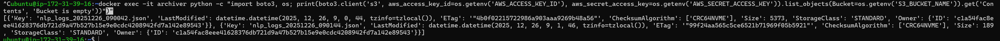
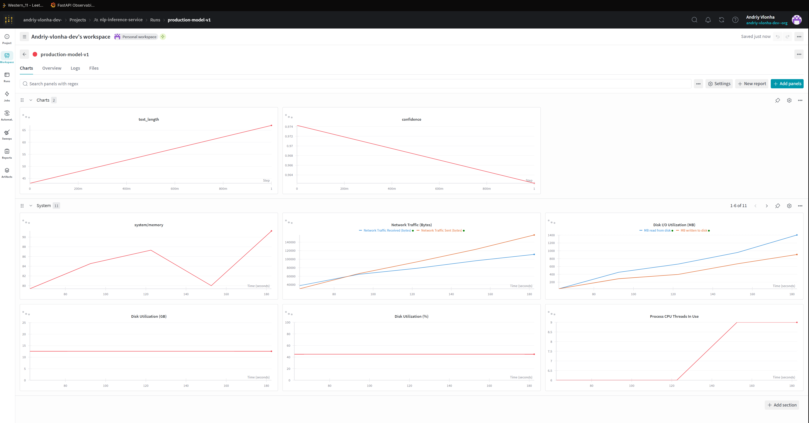

# NLP Inference Microservice (Docker Compose & Redis)


 
 
 
 


A production-ready **Microservices Architecture** for Natural Language Processing. This project orchestrates multiple containers using **Docker Compose**: a FastAPI application for inference and a **Redis** database for high-speed logging and persistence.

It features a fully automated **CI/CD Pipeline** via GitHub Actions.


## Architecture & Workflow

This project demonstrates a modern microservices approach. Instead of a monolithic script, the system decouples inference from data persistence and includes automated testing pipelines.

```mermaid
graph LR
  %% --- Styling Definitions ---
  classDef app fill:#e1f5fe,stroke:#0277bd,stroke-width:2px,color:#000
  classDef db fill:#ffcdd2,stroke:#c62828,stroke-width:2px,color:#000
  classDef ext fill:#f3e5f5,stroke:#7b1fa2,stroke-width:2px,color:#000
  classDef proxy fill:#e8f5e9,stroke:#2e7d32,stroke-width:2px,color:#000
  classDef monitor fill:#fff3e0,stroke:#ef6c00,stroke-width:2px,color:#000
  classDef alert fill:#ffab91,stroke:#d84315,stroke-width:2px,color:#000

  %% --- Actors ---
  User([User / Client])
  style User fill:#fff,stroke:#333,stroke-width:2px,color:#000

  %% --- Ingress Layer (Production) ---
  subgraph Ingress [Ingress Layer]
    direction TB
    Nginx[Nginx Reverse Proxy<br/>SSL Termination]:::proxy
  end

  %% --- Private Docker Network ---
  subgraph DockerNet [Private Docker Network]
    direction TB

    %% App Service
    subgraph Container_App [App Service]
      direction TB
      Gunicorn[Gunicorn Manager]:::app
      subgraph Workers [Async Workers]
        Uvicorn[Uvicorn Worker]:::app
        Logic[ML Inference Logic]:::app
      end
    end

    %% Archiver (Active Data Pipeline)
    Archiver[Python Archiver Service]:::app

    %% Storage Service
    Redis[(Redis DB)]:::db

    %% Monitoring Stack
    subgraph Observability [Monitoring Stack]
        Prometheus[Prometheus]:::monitor
        Grafana[Grafana Dashboards]:::monitor
        Alertmanager[Alertmanager]:::alert
    end
  end

  %% --- External / Cloud ---
  subgraph External [External Resources]
    HF_Hub[HuggingFace Hub]:::ext
    HFCache[Volume: HF Cache]:::ext
    S3[(AWS S3 Archive)]:::ext
    Telegram([Telegram Bot]):::ext
  end

  %% === Data Flow ===
  User -->|"1. HTTPS (Port 443)"| Nginx
  Nginx -->|"2. Proxy Pass (Port 8000)"| Gunicorn

  Gunicorn -->|"3. Spawn Processes"| Uvicorn
  Uvicorn -->|"4. Inference"| Logic
  
  Logic -.->|"Download (First run)"| HF_Hub
  Logic -->|"Load from"| HFCache
  
  Uvicorn -->|"5. LPUSH (Async logs)"| Redis
  Redis -->|"LTRIM (Auto-cleanup)"| Redis
  
  User -->|"GET /history"| Uvicorn
  Uvicorn <-->|"LRANGE"| Redis

  %% Archiver / Data Pipeline (Active)
  Archiver -->|"1. Fetch & Clear"| Redis
  Archiver -->|"2. Upload JSON"| S3

  %% Monitoring Flow
  Prometheus -->|"Scrape /metrics"| Uvicorn
  Grafana -->|"Query Data"| Prometheus

  %% Alerting Flow
  Prometheus -.->|"Fire Alert (Down > 1m)"| Alertmanager
  Alertmanager -.->|"Send Notification"| Telegram
  Telegram -.->|"Critical Alert"| User

  style DockerNet fill:none,stroke:#607d8b,stroke-width:2px,stroke-dasharray: 5 5
  style Ingress fill:none,stroke:none
  style External fill:none,stroke:none
  style Container_App fill:#f1f8e9,stroke:#558b2f,stroke-width:1px
  style Workers fill:#fff,stroke:none
```



## Key Features

- **Microservices Orchestration:** Fully dockerized environment via `docker-compose`.
- **CI/CD Pipeline:** Automated testing via GitHub Actions and **Automatic Deployment to AWS EC2** on every push to `main`.
- **Multi-Model Inference:** `DistilBERT` (Sentiment) & `Helsinki-NLP` (Translation).
- **Persistent Storage:** Asynchronous logging to Redis using `LPUSH`/`LTRIM`.
- **Mocked Testing:** Unit tests use `unittest.mock` to simulate ML models and Redis in CI environments.
- **MLOps Integration:** Real-time experiment tracking and model performance monitoring via **Weights & Biases**.

## Data Retention & Archiving

To prevent Redis memory exhaustion, the system implements a **scheduled archiving pipeline**:
- **Archiver Service:** A lightweight Python container that runs on a schedule.
- **Workflow:** 1. Every 60 seconds, it performs an atomic `RENAME` of the log key in Redis.
  2. It converts the raw data into a structured `.json` file.
  3. The file is uploaded to an **AWS S3 Bucket** with a timestamped filename.
  4. Local cache and temporary Redis keys are cleared.
- **Benefits:** Long-term storage for ML re-training while keeping the production DB lean.



## Tech Stack

- **Orchestration:** Docker Compose
- **CI/CD:** GitHub Actions
- **Core:** Python 3.9, FastAPI, Uvicorn
- **Database:** Redis (Alpine)
- **ML Backend:** PyTorch, Transformers
- **Infrastructure:** Docker Compose, Nginx (Reverse Proxy)
- **Security:** SSL/TLS (Let's Encrypt), Automated Cert Renewal
- **Models:**
  - `distilbert-base-uncased-finetuned-sst-2-english`
  - `Helsinki-NLP/opus-mt-en-fr`

## Project Structure

```
.
├── app/                  # Inference Service (FastAPI)
│   ├── main.py           # API endpoints and ML logic
│   ├── Dockerfile        # Multi-stage production build
│   └── requirements.txt  # NLP & Web dependencies
├── archiver/             # Data Pipeline Service (S3 Worker)
│   ├── main.py           # Scheduled archiving logic
│   ├── Dockerfile        # Lightweight Python environment
│   └── requirements.txt  # Boto3, Redis, and Scheduling tools
├── alertmanager/         # Monitoring alerts configuration
├── grafana/              # Dashboards as Code (JSON)
├── nginx/                # Reverse Proxy & SSL configuration
├── prometheus/           # Metrics collection & alerting rules
├── tests/                # Unit & Integration testing suite
├── docker-compose.yml    # Full stack orchestration
├── .github/workflows/    # CI/CD Automated Pipelines
└── README.md             # Documentation

```

## Installation and Setup

### Prerequisites
Docker Engine & Docker Compose installed.

### Quick Start (Local)
1. **Clone the repository:**
```bash
git clone https://github.com/Western-1/nlp-inference-service
cd nlp-inference-service
```
2. **Start the Services:**
```bash
docker-compose up --build
```
3. **Access API:**
Open `http://localhost:8000/docs` to see the Swagger UI.

4. **Create .env file:**
Create a `.env` file in the root directory with your credentials (optional for local test, required for S3):
```bash
AWS_ACCESS_KEY_ID=your_key
AWS_SECRET_ACCESS_KEY=your_secret
S3_BUCKET_NAME=your_backet_name
...
```
and etc..

## Development & Testing

This project uses **Pytest** for unit and integration testing. The CI pipeline runs these tests automatically.

To run tests locally:
```bash
pip install pytest httpx

PYTHONPATH=. pytest tests/ -v
```

## Code Quality & Security
The project follows strict development standards to ensure code quality and security. Every commit triggers a GitHub Actions pipeline that runs:

- Linting (`flake8`): Enforces PEP8 style guide and catches syntax errors.

- Security Scanning (`bandit`): Scans the code for common vulnerabilities (e.g., hardcoded secrets, unsafe functions).

## Run checks locally
You can run the same checks on your machine before pushing code:
```bash
# 1. Install quality tools
pip install flake8 bandit

# 2. Check code style (Linting)
flake8 . --count --show-source --statistics

# 3. Scan for security vulnerabilities
bandit -r .
```

## Deployment (AWS EC2)

The project uses a **Continuous Deployment (CD)** pipeline. Any change pushed to the `main` branch is automatically deployed to the AWS EC2 instance using GitHub Actions.

### 1. Initial Setup (One-time)
Provision the infrastructure and setup Docker:
1. Launch an AWS `t3.micro` instance (Ubuntu 24.04).
2. Configure Security Group: Open ports `22` (SSH), `80` (HTTP), and `443` (HTTPS).
3. Connect via SSH and install Docker & Docker Compose.
4. Clone the repo manually **only for the first run**:
   ```bash
   git clone [https://github.com/Western-1/nlp-inference-service](https://github.com/Western-1/nlp-inference-service)
   cd nlp-inference-service
   docker compose up -d --build

### 2. Configure GitHub Secrets
For the CD pipeline to work, add these secrets in repo settings (`Settings` -> `Secrets and variables` -> `Actions`):

| Secret Name | Value | Description |
|-------------|-------|-------------|
| `EC2_HOST` | Public IP / DNS | Address of your AWS instance |
| `EC2_USER` | `ubuntu` | SSH Username |
| `EC2_SSH_KEY` | `-----BEGIN RSA...` | Private SSH Key content |
| `WANDB_API_KEY`| `ef2f...` | API Key for Weights & Biases |
| `TELEGRAM_TOKEN`| `12345:ABC...` | Bot Token from @BotFather |
| `TELEGRAM_CHAT_ID`| `12345678` | Your User ID for notifications |
| `AWS_ACCESS_KEY_ID` | `AKIA...` | IAM User Access Key with S3 permissions |
| `AWS_SECRET_ACCESS_KEY` | `wJalrX...` | IAM User Secret Access Key |
| `S3_BUCKET_NAME` | `western-nlp-logs-archive` | Target S3 Bucket name |

## 3. Automatic Updates
No manual action is required for updates.

Push changes to `main`.

GitHub Actions will SSH into the server, pull the latest code, rebuild containers, and cleanup unused images.

## API Documentation

### 1. Health Check
`GET /` - Checks service status and Redis connection.

### 2. Request History
`GET /history` - Returns the last 10 requests stored in Redis.


### 3. Sentiment Analysis
`POST /sentiment` - Classifies text as **POSITIVE** or **NEGATIVE**.

**Example Request:**
```json
{
  "text": "The deployment process was incredibly smooth."
}
```
**Example Response:**
```json
{
  "result": [
    {
      "label": "POSITIVE",
      "score": 0.9998
    }
  ]
}
```

### 4. Translation (En → Fr)
`POST /translate` - Translates English text to French.

**Example Response:**
```json
{
  "translated_text": "Bonjour le monde, c'est un test."
}
```


## Live Demo

Try the API live here (Reverse Proxy via Nginx):  
**[https://western-nlp.ddns.net/docs](https://western-nlp.ddns.net/docs)**

> [!IMPORTANT]
> Active (Hosted on AWS EC2 Free Tier)

> [!NOTE]
> Since this is a free tier instance, it might be stopped to save resources. If the link is down, please **contact me**, and I will restart it immediately.


## Monitoring & Metrics

The project includes a comprehensive monitoring stack based on **Prometheus** and **Grafana**. It provides real-time insights into application performance, resource usage, and traffic patterns.

### Alerting Architecture
The system monitors the health of the application continuously.

1. **Prometheus** checks `up{job="nlp-app"}` every 5 seconds.
2. If the service is unreachable for **more than 1 minute**, an alert is fired.
3. **Alertmanager** receives the alert and pushes a notification to the configured **Telegram Chat**.

*(This ensures you sleep well, knowing the server will wake you up if it crashes!)*

### Live Access
You can view the raw metrics exposed by the application here:
**Metrics Endpoint:** [https://western-nlp.ddns.net/metrics](https://western-nlp.ddns.net/metrics)


### How to check locally
If you run the container locally, you can check metrics via curl:
```bash
curl http://localhost:8000/metrics
```
### Grafana Dashboard
Visualizes key metrics such as Requests Per Second (RPS), Latency (P99), Memory Usage, and HTTP Status Codes.


## MLOps: Experiment Tracking

The project is fully integrated with **Weights & Biases (W&B)** to track model performance in production. Unlike standard system monitoring (Prometheus), W&B focuses on the **quality of the ML model**.

It logs:
- **Inputs & Outputs:** What users are asking and how the model responds.
- **Confidence Scores:** Tracks how "sure" the model is about its predictions.
- **System Resources:** Correlates inference time with CPU/Memory usage.




## License

**MIT License**

Copyright (c) 2025 Andriy Vlonha

Permission is hereby granted, free of charge, to any person obtaining a copy of this software and associated documentation files (the "Software"), to deal in the Software without restriction, including without limitation the rights to use, copy, modify, merge, publish, distribute, sublicense, and/or sell copies of the Software, and to permit persons to whom the Software is furnished to do so, subject to the following conditions:

The above copyright notice and this permission notice shall be included in all copies or substantial portions of the Software.
