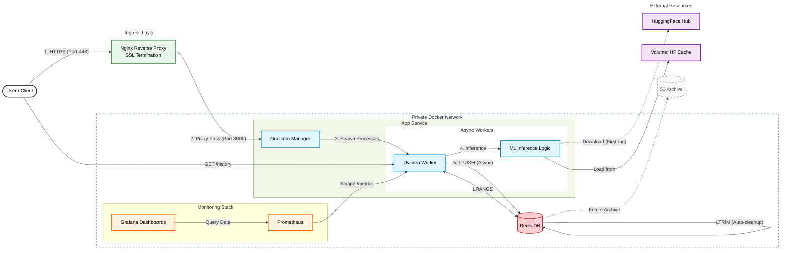
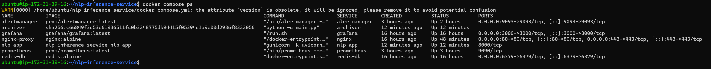

# NLP Inference Microservice (Docker Compose & Redis)

 
 
 
 
 


A production-ready **Microservices Architecture** for Natural Language Processing. This project orchestrates multiple containers using **Docker Compose**: a FastAPI application for inference and a **Redis** database for high-speed logging and persistence.

It features a fully automated **CI/CD Pipeline** via GitHub Actions.


## Architecture & Workflow

This project demonstrates a modern microservices approach. Instead of a monolithic script, the system decouples inference from data persistence and includes automated testing pipelines.



## Key Features

- **Microservices Orchestration:** Fully dockerized environment via `docker-compose`.
- **CI/CD Pipeline:** Automated testing via GitHub Actions on every push.
- **Multi-Model Inference:** `DistilBERT` (Sentiment) & `Helsinki-NLP` (Translation).
- **Persistent Storage:** Asynchronous logging to Redis using `LPUSH`/`LTRIM`.
- **Mocked Testing:** Unit tests use `unittest.mock` to simulate ML models and Redis in CI environments.

## Tech Stack

- **Orchestration:** Docker Compose
- **CI/CD:** GitHub Actions
- **Core:** Python 3.9, FastAPI, Uvicorn
- **Database:** Redis (Alpine)
- **ML Backend:** PyTorch, Transformers
- **Infrastructure:** Docker Compose, Nginx (Reverse Proxy)
- **Security:** SSL/TLS (Let's Encrypt), Automated Cert Renewal
- **Models:**
  - `distilbert-base-uncased-finetuned-sst-2-english`
  - `Helsinki-NLP/opus-mt-en-fr`

## Project Structure

```
.
├── .github/workflows/        # CI/CD pipeline configuration (GitHub Actions)
├── grafana/                 # Grafana dashboard templates (JSON)
├── Images/                  # Documentation screenshots and diagrams
├── nginx/                   # Nginx reverse proxy configuration
├── prometheus/              # Prometheus monitoring rules & alerting
├── tests/                   # Unit & integration tests
├── docker-compose.yml       # Service orchestration (app, redis, nginx, monitoring)
├── Dockerfile               # FastAPI container configuration
├── main.py                  # Application entrypoint (FastAPI app)
└── requirements.txt         # Python dependencies
```

## Installation and Setup

### Prerequisites
Docker Engine & Docker Compose installed.

### Quick Start (Local)
1. **Clone the repository:**
```bash
git clone https://github.com/Western-1/nlp-inference-service
cd nlp-inference-service
```
2. **Start the Services:**
```bash
docker-compose up --build
```
3. **Access API:**
Open `http://localhost:8000/docs` to see the Swagger UI.

## Development & Testing

This project uses **Pytest** for unit and integration testing. The CI pipeline runs these tests automatically.

To run tests locally:
```bash
pip install pytest httpx

pytest tests/ -v
```

## Deployment (AWS EC2)

This service is designed to be deployed on AWS EC2 (Ubuntu Server).

1. **Provision Infrastructure:**
   - Launch `t3.micro` instance (Ubuntu 24.04).
   - Configure Security Group: Open ports `22` (SSH), `80`(HTTP) and `443` (HTTPS).
   - Configure Swap file (4GB) to handle ML model memory requirements.

2. **Deploy:**
```bash
ssh -i key.pem ubuntu@<EC2_IP>
git clone https://github.com/Western-1/nlp-inference-service
docker compose up -d --build
```

## API Documentation

### 1. Health Check
`GET /` - Checks service status and Redis connection.

### 2. Request History
`GET /history` - Returns the last 10 requests stored in Redis.


### 3. Sentiment Analysis
`POST /sentiment` - Classifies text as **POSITIVE** or **NEGATIVE**.

**Example Request:**
```json
{
  "text": "The deployment process was incredibly smooth."
}
```
**Example Response:**
```json
{
  "result": [
    {
      "label": "POSITIVE",
      "score": 0.9998
    }
  ]
}
```

### 4. Translation (En → Fr)
`POST /translate` - Translates English text to French.

**Example Response:**
```json
{
  "translated_text": "Bonjour le monde, c'est un test."
}
```


## Live Demo

Try the API live here (Reverse Proxy via Nginx):  
**[https://western-nlp.ddns.net/docs](https://western-nlp.ddns.net/docs)**

> [!IMPORTANT]
> Active (Hosted on AWS EC2 Free Tier)

> [!NOTE]
> Since this is a free tier instance, it might be stopped to save resources. If the link is down, please **contact me**, and I will restart it immediately.



## Monitoring & Metrics

The project includes a comprehensive monitoring stack based on **Prometheus** and **Grafana**. It provides real-time insights into application performance, resource usage, and traffic patterns.

### Live Access
You can view the raw metrics exposed by the application here:
**Metrics Endpoint:** [https://western-nlp.ddns.net/metrics](https://western-nlp.ddns.net/metrics)


### How to check locally
If you run the container locally, you can check metrics via curl:
```bash
curl http://localhost:8000/metrics
```
### Grafana Dashboard
Visualizes key metrics such as Requests Per Second (RPS), Latency (P99), Memory Usage, and HTTP Status Codes.


## License

**MIT License**

Copyright (c) 2025 Andriy Vlonha

Permission is hereby granted, free of charge, to any person obtaining a copy of this software and associated documentation files (the "Software"), to deal in the Software without restriction, including without limitation the rights to use, copy, modify, merge, publish, distribute, sublicense, and/or sell copies of the Software, and to permit persons to whom the Software is furnished to do so, subject to the following conditions:

The above copyright notice and this permission notice shall be included in all copies or substantial portions of the Software.
